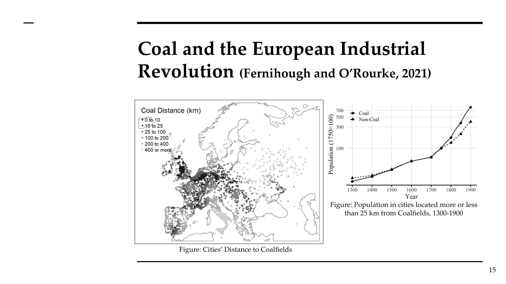
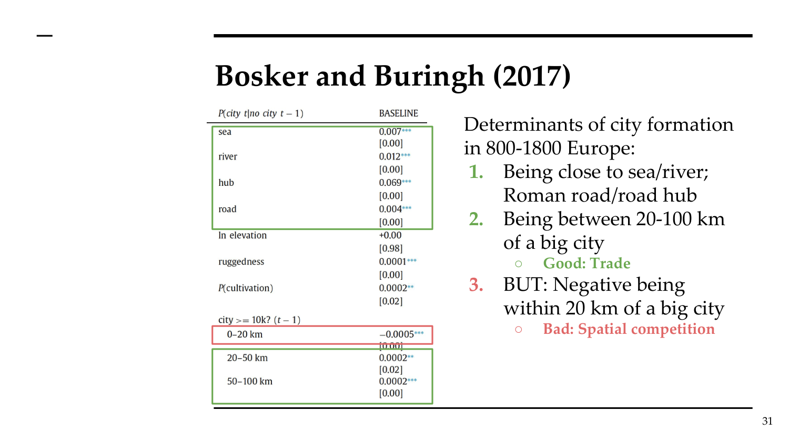

# AT Topic 1: Regional and Urban Concentration Forces
> 课件：AT_Topic1_Urban_Systems.pdf | 讲师：Sara Bagagli

---

## 核心问题框架

本讲回答两个根本问题：

```
问题1: 为什么存在大型工业区域 (industrial regions)?
  └── 答案1: 自然禀赋 (location fundamentals) — 煤炭、港口等
  └── 答案2: 运输成本 + 规模收益 (Krugman 1991)

问题2: 为什么存在城市 (cities)?
  └── 答案1: 自然禀赋 — 天然港口、贸易枢纽
  └── 答案2: 集聚经济 (Marshall agglomeration economies)
```

---

## 一、为什么存在工业区域

### 1.1 自然禀赋 (Location Fundamentals)

某些地点具有天然高价值：煤炭、矿产、港口。工业革命（1760-1860）时期，工业区往往紧邻自然资源。

**关键文献：Fernihough & O'Rourke (2021)**

研究问题：煤矿对欧洲工业化城市增长的影响

核心发现：
- **1750年前**：距煤矿远近与城市增长无关
- **1750年后**：近煤矿城市显著增长更快
- 距最近煤矿49km以内的城市，比距离再远85km的城市增长**快21%**

为什么？煤炭重、体积大、运输昂贵；且使用后重量消失（转化为能量），所以在煤矿附近生产能大幅节省成本。



---

### 1.2 Krugman (1991) 核心-边缘模型 (Core-Periphery Model)

**Paul Krugman的开创性贡献**：位置是有维度的 + 生产存在规模收益递增

**三个关键要素**：
| 要素 | 作用 |
|------|------|
| 规模收益递增 (increasing returns) | 激励集中生产 |
| 运输成本 (trade costs) | 激励靠近消费者分散生产 |
| 要素流动性 (factor mobility) | 工人可以迁移 |

**简化模型参数**：
- 两个地区：东(E)和西(W)
- 6个不可移动农民（各3个）+ 4个可移动工人
- 总人口10人，每人需求1单位商品
- 每个工厂固定成本 = 4
- 区内运输成本 = 0；跨区运输成本 = 可变

**关键案例分析**：

**Case A/B（工人均分在E和W，运输成本=1）**：
```
生产全在E：运输3件商品到W → 运输成本=3；固定成本=4；总计=7
生产在E和W：无运输；固定成本=8（开两个厂）；总计=8
→ 集中在一个地区更便宜！→ 但集中在哪里无所谓（对称）
```

**Case C（所有工人都在E，运输成本=1）**：
```
              东(E)  西(W)
农民:          3      3
工人:          4      0
总人口:        7      3

生产全在E：运3件商品到W → 运费3 + 固定成本4 = 7  ← 最优！
生产在E&W：无运费 + 固定成本8 = 8
生产全在W：运7件到E → 运费7 + 固定成本4 = 11

→ 当工人聚集在E时，E成为核心(core)！
```

**Case D（运输成本=0.5，仍有agglomeration）**：
总成本E=5.5 < E&W=8 < W=7.5 → 仍然集中在E

**Case E（运输成本=2，工人全在E）**：
总成本E=10 > E&W=8 → 运输成本过高，分散生产

**Case F（运输成本=2，工人均分）**：
成本相等，无agglomeration incentive

**模型关键结论**：

```
运输成本高 → 分散（靠近消费者）
运输成本低 → 集聚（规模经济主导）
中等运输成本 → 两种均衡均可能（取决于历史/预期/偶然）

         agglomeration
              ↑
              |  ████████████
              | ██          ██ ← 多重均衡区间
              |█              █
   dispersion |________________█____
              低   中    高    运输成本
```

**重要的路径依赖含义**：即使先验条件对称，集聚可以发生在任一地区，历史偶然性(chance)、预期(expectations)、初始条件(history)起重要作用。

---

## 二、为什么存在城市

### 2.1 贸易城市 (Trading Cities)

**两种机制**：
1. **比较优势**：地理、制度、传统差异 → 专业化与贸易
2. **交换的规模经济**：不可分投入、工人专业化、天然港口

代表：雅典、纽约（工业化前的主导力量）

**Bosker & Buringh (2017) — 800-1800年欧洲城市体系**：

城市形成的决定因素：
1. ✅ 靠近海洋/河流；罗马道路/道路枢纽（第一自然地理）
2. ✅ 与大城市距离20-100km（贸易好处，第二自然地理）
3. ❌ 与大城市距离<20km（空间竞争）



---

### 2.2 工厂城市 (Factory Cities)

**机制**：生产规模经济
- 不可分投入（机器、固定成本）
- 工人专业化 → 更高生产率 → 更高工资 → 更多工人通勤

与农产品贸易，形成工厂城镇。工业化时期主导。

---

### 2.3 集聚经济 (Agglomeration Economies) — Marshall 1890

**核心思想**：存在城市特有的规模收益（外部于单个企业的）。
- 城市有更高成本（拥堵、高租金、高工资）
- 但城市企业也有更高生产率来抵消这些成本

**两类集聚经济**：
| 类型 | 定义 | 例子 |
|------|------|------|
| **本地化经济** (Localization) | 同行业企业集群 | 底特律汽车、伦敦金融 |
| **城市化经济** (Urbanization/Jacobs) | 跨行业多元服务集聚 | 法律、地产、休闲等辅助服务 |

**马歇尔三角 (Marshallian Externalities)**：

```
        集聚经济的三大微观基础
        (Duranton & Puga, 2004)

    ┌──────────────────────────────┐
    │                              │
    │   共享投入 ←→ 劳动力市场 ←→ 知识溢出  │
    │  (Sharing)   (Matching)   (Learning) │
    │                              │
    └──────────────────────────────┘
```

#### 共享投入 (Shared Inputs)

**传统投入**：原材料、劳动、资本（相对可移动）

**非贸易本地中间投入**（关键！）：
- 专业化本地可用投入（高Weber运输成本）
- 不可分投入（固定成本高）
- 只有在集群中才能以低成本获得（如专业法律服务）

#### 劳动力市场汇聚 (Labor Market Pooling)

**三个子机制**：

1. **分类 (Sorting)**：更大的劳动力池 → 更弹性的供给 → 需求冲击引起量变大、价变小
```
小集群：需求↑ → 工资大涨，数量小增
大集群：需求↑ → 工资微涨，数量大增 ← 对企业更好
```

2. **匹配 (Matching)**：更好的企业-工人匹配质量
   - 正向分类匹配：高质量工人 → 高质量企业
   - Dauth et al.(2022)：德国匹配数据证实城市密度提升匹配质量

3. **学习 (Learning)**：工人互相学习，技能积累
   - De La Roca & Puga (2017)：迁往大城市（马德里）的工人工资增长快于留在小城市（圣地亚哥）的工人

#### 知识溢出 (Knowledge Spillovers)

- 通过面对面接触和偶然相遇传播
- Andrews (2020)：酒精禁令→减少酒吧交流→专利数量下降（知识溢出需要非正式社交）
- 非市场方式共享（产品、工艺、技术）
- 专业集群（"硅谷"模式）

---

## 三、对房地产市场的影响

集聚 → **增加对房地产的需求** → 需求曲线右移 → 更高租金/价格

集聚 → 生产率↑ → 工资↑ → 房地产需求↑ → 租金↑

生产率来源的变化（如新技术、知识溢出强化）会影响未来需求。

---

## 四、考试要点

### 核心模型总结

| 模型 | 核心机制 | 关键预测 |
|------|----------|----------|
| Krugman (1991) | 规模收益 + 运输成本 | 低运输成本→集聚；高运输成本→分散；路径依赖 |
| Marshall (1890) | 外部规模收益 | 共享/匹配/学习三机制；城市化vs本地化经济 |
| Fernihough & O'Rourke (2021) | 自然禀赋（煤炭） | 1750后近煤矿城市快21%；运输成本下降95% |

### Krugman vs Marshall 比较

| | Krugman 1991 | Marshall 1890 |
|---|---|---|
| 规模收益类型 | **内部**（企业层面固定成本） | **外部**（企业间溢出） |
| 关键成本 | 货物运输成本（低→集聚） | 人员运输成本（高→集聚） |
| 应用 | 解释区域工业集聚 | 解释城市存在 |

### 可能的考题方向

**Essay型**：
- "Explain why economic activity is spatially concentrated, using both location fundamentals and agglomeration theory"
- 答题框架：自然禀赋（煤炭/Fernihough）→ Krugman运输成本机制 → Marshall城市层面外部性 → 房地产影响

**Partitioned型**：
- (a) 解释Krugman模型的三个要素及其预测
- (b) 用数值例子解释为何低运输成本导致集聚
- (c) Marshall三角的三个微观基础分别是什么？

### 关键数字记忆
- **21%**：近煤矿城市比远处城市增长快的幅度（Fernihough & O'Rourke）
- **49km vs 85km**：参照距离（距最近煤矿49km vs 再远85km）
- **95%**：1700-1850年英国运输成本下降幅度（Bogart, 2014）
- **固定成本=4**：Krugman模型中的工厂建设成本（理解分散vs集中决策）
