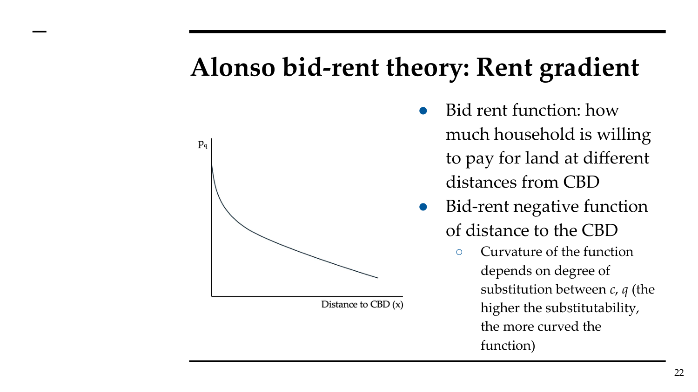
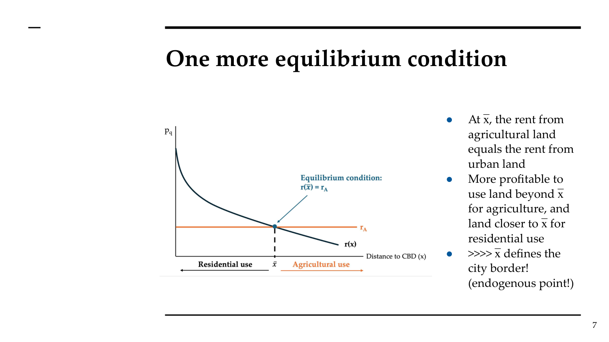
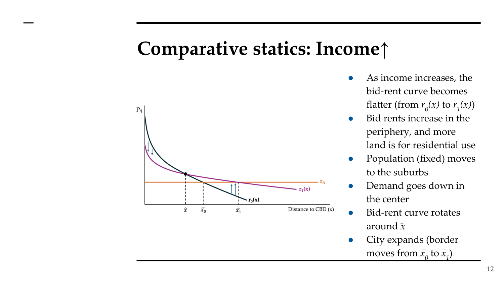
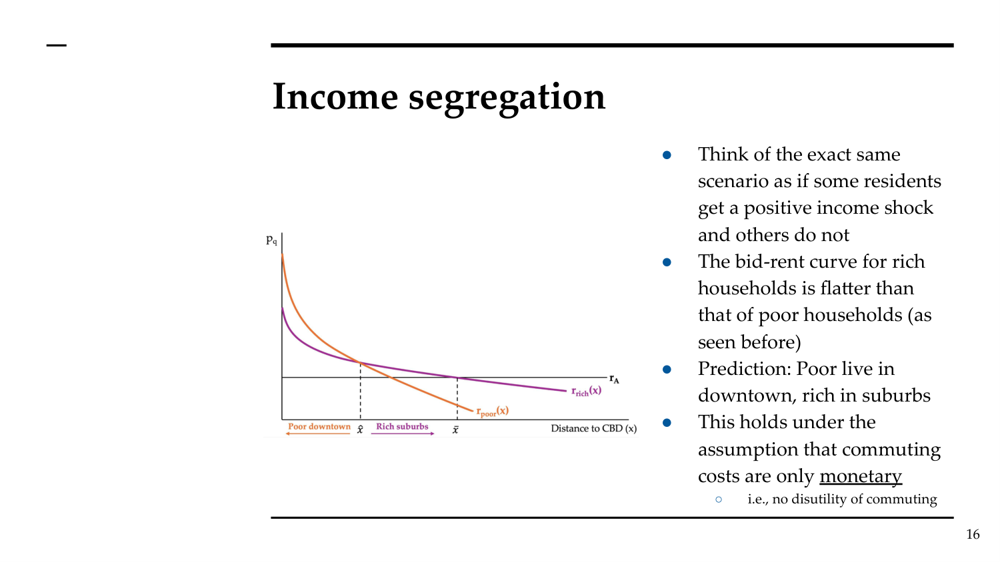

# AT Topics 4 & 5: Monocentric City Model (AMM)
> 课件：AT_Topic4_Housing_Supply.pdf + AT_Topic5_Monocentric_City.pdf | 讲师：Sara Bagagli

---

## 思想史背景

```
Ricardo (1817) → Von Thünen (1826) → Alonso (1964) → Mills (1967) / Muth (1969)
                                                         ↓
                              Alonso-Mills-Muth (AMM) — 城市经济学核心工具
```

| 学者 | 年份 | 核心贡献 |
|------|------|----------|
| Ricardo | 1817 | 区位优势须通过更高租金补偿 → "补偿性差异"起源 |
| Von Thünen | 1826 | 以土地可及性替代肥沃度 → 价格随距中心距离下降 |
| Alonso | 1964 | 搬到城市背景：以通勤成本替代货物运输 → bid-rent曲线 |
| Mills & Muth | 1967/69 | 加入竞争性建筑部门 → 楼层密度、建筑高度、地价 |

---

## 一、Alonso bid-rent模型（Topic 4）

### 1.1 核心假设

- **A1**：唯一区位优势 = 到CBD（中央商务区）的可及性
- **A2**：均匀平坦土地（无自然禀赋差异）
- **A3**：相同的家庭和企业
- **A4**：无政府
- **A5**：无开发商（家庭直接消费土地）
- **A6**：人口固定（无迁移）

### 1.2 家庭问题

**效用函数**：U = U(c, q)，其中c=复合品消费，q=土地消费

**预算约束**：y - tx = p_q · q + c

- y = 工资收入
- t = 单位距离通勤成本
- x = 到CBD的距离
- p_q = 土地/住房租金

**空间均衡条件**：所有位置效用相等 = Ū

### 1.3 租金梯度推导

从预算约束解出p_q：

**p_q = (y - tx - c) / q**

对x求偏导：

**∂p_q/∂x = -t/q < 0**

→ 租金随距CBD距离**严格递减**

### 1.4 直觉图解



- **斜率** = -t/q（通勤成本越高，斜率越陡）
- **曲率**：取决于c和q的替代弹性（替代性越高，曲线越弯曲）

### 1.5 Alonso模型的其他预测

| 对象 | 随距离x增大的变化 | 原因 |
|------|-------------------|------|
| 租金 p_q | ↓ | ∂p_q/∂x = -t/q < 0 |
| 土地消费 q | ↑ | p_q下降 → 需求量增加 |
| 人口密度 D = 1/q | ↓ | q↑ → D = 1/q↓ |
| 对通勤成本t↑ | p_q↓ | ∂p_q/∂t = -x/q < 0 |
| 对收入y↑ | p_q↑ | ∂p_q/∂y = 1/q > 0 |

---

## 二、Muth-Mills模型：加入建筑部门（Topic 4）

### 2.1 核心变化

Alonso：家庭直接消费**土地**
Muth-Mills：家庭消费**住房**，住房由开发商用**土地+资本**生产

**住房生产函数**：H = H(K, L)，凹性（H'>0, H''<0）

**结构密度**：S = K/L（资本/土地比 → 近似于楼层密度）

### 2.2 开发商利润最大化

利润函数：π = p_q · H(K,L) - K - r·L = 0（竞争 → 零利润）

最优条件：p_q · h'(S) = 1（边际住房产出×住房价格 = 资本边际成本）

**关键结论**：p_q↑ → S↑（租金越高，开发商建越高的楼）

### 2.3 Muth-Mills预测汇总

| 变量 | 随p_q↑ | 随距离x↑（因p_q↓） |
|------|--------|---------------------|
| 地价 r | ↑ | ↓ |
| 结构密度 S = K/L | ↑ | ↓ |
| 住房密度 H/L | ↑ | ↓ |
| 人口密度 D = h/q | — | ↓ |
| 住房消费 q | ↓ | ↑ |

```
                CBD中心  →  郊区
租金:         高 ████████░░░░ 低
建筑高度:     高 ████████░░░░ 低  ← Muth-Mills独特贡献
地价:         高 ████████░░░░ 低
人口密度:     高 ████████░░░░ 低
住房面积:     小 ░░░░░░░░████ 大
```

### 2.4 实证证据

**全球数据（Liotta et al. 2022）**：

- **租金梯度**：平均每公里距CBD远1km，租金下降 **1.4%**
- **人口密度梯度**：平均每公里下降 **8.5%**
- 大多数城市（全球192个）租金梯度与AMM一致

**关键数字（考试必背）**：
```
租金梯度:    -1.4%/km（全球平均）
人口密度梯度: -8.5%/km（全球平均）
```

**芝加哥数据（Ahlfeldt & McMillen 2018）**：
- 建筑高度随距CBD距离增加而下降，与S随p_q下降的预测一致

---

## 三、城市边界与均衡条件（Topic 5）

### 3.1 城市边界x̄

**条件**：x̄处，城市土地租金 = 农业土地租金 r_A



超过x̄：农业用途更有利可图 → 不纳入城市

### 3.2 内外生变量对应（重要！）

**外生变量**（模型外部决定）：收入y、通勤成本t、农业地租r_A
**内生变量**（模型内部求解）：住房租金p_q、地价r、结构密度S、人口密度D、城市边界x̄

**封闭城市**（closed city）：总人口N外生，效用Ū内生
**开放城市**（open city）：效用Ū外生（由其他城市决定），总人口N内生

---

## 四、比较静态分析（Topic 5）

### 4.1 收入增加（y↑）

**机制**：
- q是正常品 → y↑ → q(y)↑
- 租金梯度斜率 ∂p_q/∂x = -t/q → t/q(y)↓ → 梯度**变平**



**要点**：
- r₀(x)→r₁(x)：曲线变平，围绕旋转点 x̂ 转动
- 市中心租金↓，郊区租金↑
- 城市边界从 x̄₀ 扩张到 x̄₁
- 人口去中心化

**收入隔离（Income Segregation）**：

富人bid-rent曲线**更平**（消费更多住房，对距离不敏感）→ 住郊区
穷人bid-rent曲线**更陡** → 住市中心



**要点**：货币通勤成本假设下，r_poor(x) 较陡，r_rich(x) 较平，两线交叉点 x̂ 为居住边界 → 穷人住 x̂ 左侧市中心，富人住 x̂ 右侧郊区

**注意**：若考虑时间价值，结论变得模糊（富人时间更贵→宁愿住近）
- 可解释现实城市差异（中心富裕的巴黎 vs 市中心贫困的洛杉矶）

### 4.2 通勤成本下降（t↓）

**效果类似收入增加**：
- ∂p_q/∂x = -t/q → t↓ → 梯度变平
- bid-rent曲线旋转变平
- 城市扩张，人口移向郊区
- 市中心租金↓，郊区租金↑
- 效用↑（通勤成本降低 = 等效于收入增加）

### 4.3 去中心化的因果证据：Baum-Snow (2007)

**研究问题**："高速公路导致了城市郊区化吗？"

**内生性问题**：
- 人口已经向郊区移动的城市可能更需要高速公路
- → 高速公路建设是郊区化的**原因**还是**结果**？

**工具变量（IV）**：
- 1947年国家高速公路规划中通过城市的射线数
- 美国州际公路系统设计目的是**连接远方城市**（贸易和国防），非方便本地通勤
- 某些都市区因位置原因获得更多高速公路（外生原因）

```
IV策略：
Z（1947规划射线数）→ X（实际高速公路数，1950-1990）→ Y（市中心人口变化）
                                                      ↑
                                             控制其他影响郊区化的因素
```

**主要结果**：

**每多一条穿越市中心的高速公路，市中心人口减少约18%**

### 4.4 比较静态汇总表（Brueckner 1987）

**封闭城市**（N固定，Ū内生）：

| 冲击 | 城市面积 | 市中心租金 | 郊区租金 | 市中心人口密度 | 郊区人口密度 | 效用 |
|------|----------|------------|----------|----------------|--------------|------|
| 收入y↑ | ↑ | ↓ | ↑ | ↓ | ↑ | ↑ |
| 通勤成本t↑ | ↓ | ↑ | ↓ | ↑ | ↓ | ↓ |
| 农业地租r_A↑ | ↓ | ↑ | ↑ | ↑ | ↑ | ↓ |
| 总人口N↑ | ↑ | ↑ | ↑ | ↑ | ↑ | ↓ |

**开放城市**（Ū固定，N内生）：

| 冲击 | 城市面积 | 城市内租金 | 城市内人口密度 | 人口N |
|------|----------|------------|----------------|-------|
| 收入y↑ | ↑ | ↑（全城） | ↑（全城） | ↑ |
| 通勤成本t↑ | ↓ | ↓（全城） | ↓（全城） | ↓ |

**开放vs封闭城市的关键差异**：

| | 封闭城市 | 开放城市 |
|---|---|---|
| N | 外生固定 | 内生，随吸引力变化 |
| Ū | 内生 | 外生（由国家水平决定） |
| 何时使用 | 全国性政策（所有城市同时变化） | 单城市政策（一个城市相对其他变化） |

**开放城市特殊之处（收入↑）**：
- 封闭：人口从市中心移到郊区，市中心人口下降
- 开放：外地人也涌入 → **市中心人口不下降**！

---

## 五、实证检验

### 5.1 Liotta et al. (2022) — 全球192城市

| 指标 | 平均梯度 | 特点 |
|------|----------|------|
| 租金 | -1.4%/km | 北美/大洋洲更平坦 |
| 人口密度 | -8.5%/km | 大城市更平坦 |

大多数城市租金梯度符号与AMM预测一致。

### 5.2 Heblich et al. (2020) — 伦敦蒸汽铁路

- 蒸汽铁路发明→首次大规模工作/居住分离
- 移除铁路网络：人口和地价↓50%
- → 交通基础设施对城市结构的巨大影响

---

## 六、考试要点

### 核心数字（必背！）

| 数字 | 含义 |
|------|------|
| **-1.4%/km** | 全球平均租金梯度（Liotta et al. 2022） |
| **-8.5%/km** | 全球平均人口密度梯度（Liotta et al. 2022） |
| **-18%** | 每增加一条高速公路，市中心人口变化（Baum-Snow 2007） |
| **-50%** | 移除伦敦铁路网络，人口和地价变化（Heblich et al. 2020） |

### 模型核心公式

```
∂p_q/∂x = -t/q < 0     ← 租金梯度（负斜率）
∂p_q/∂t = -x/q < 0     ← 通勤成本↑→租金↓
∂p_q/∂y = 1/q > 0      ← 收入↑→租金↑

城市边界：r_urban(x̄) = r_agricultural

人口密度（Alonso）：D = 1/q
人口密度（Muth-Mills）：D = h/q（h=住房密度）
```

### 考题方向

**Essay型**：
- "Use the Alonso-Mills-Muth model to explain the spatial structure of cities. What does the empirical evidence tell us?"
- 答题框架：模型假设 → bid-rent逻辑（均衡→∂p_q/∂x<0）→ Muth-Mills加建筑部门 → 比较静态（收入/通勤） → 实证（-1.4%/km，-8.5%/km）→ Baum-Snow因果证据

**Partitioned型**：
- (a) 推导Alonso模型中租金梯度斜率，解释其含义
- (b) 收入增加如何影响城市空间结构？区分封闭城市和开放城市
- (c) Baum-Snow (2007)如何用工具变量解决内生性问题？主要结果是什么？

### AMM的局限性

1. 假设所有就业在CBD → 现实中多中心城市（polycentric）
2. 假设同质家庭 → 现实中有收入隔离
3. 静态模型 → 无法解释动态城市演变
4. 忽略土地使用法规的供给约束（Topic 6/WT讨论）
