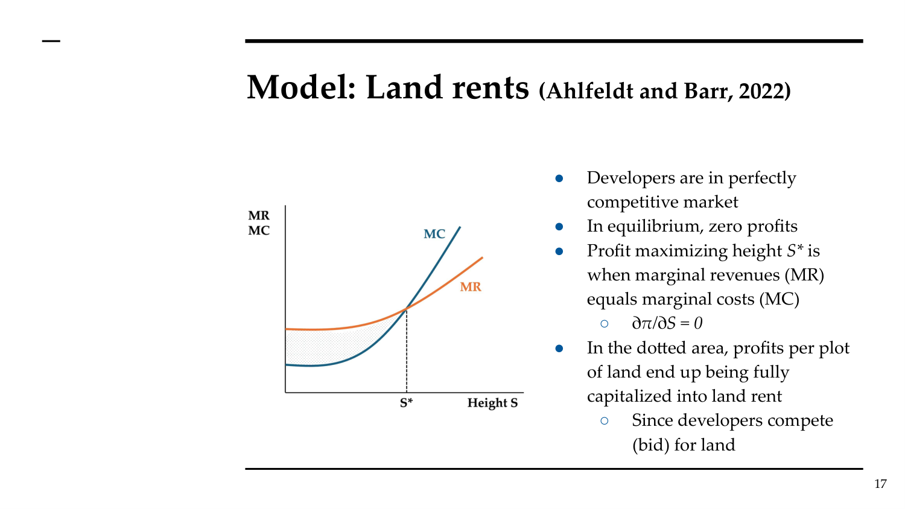
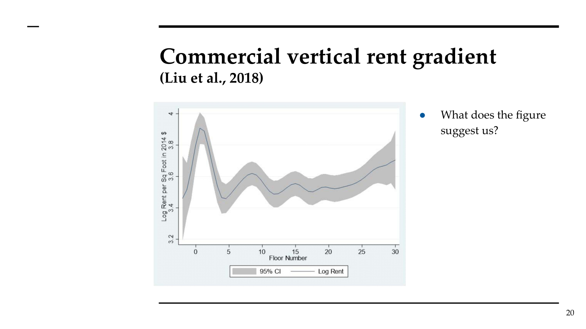
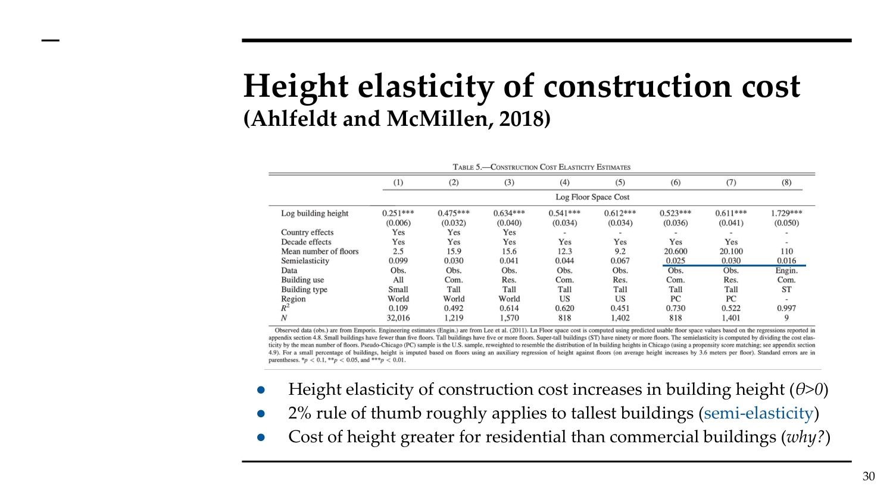
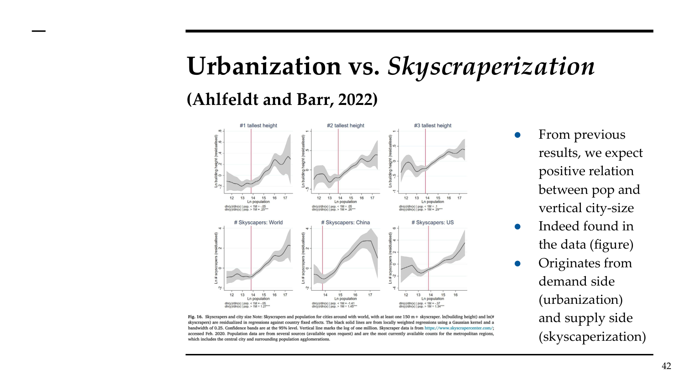
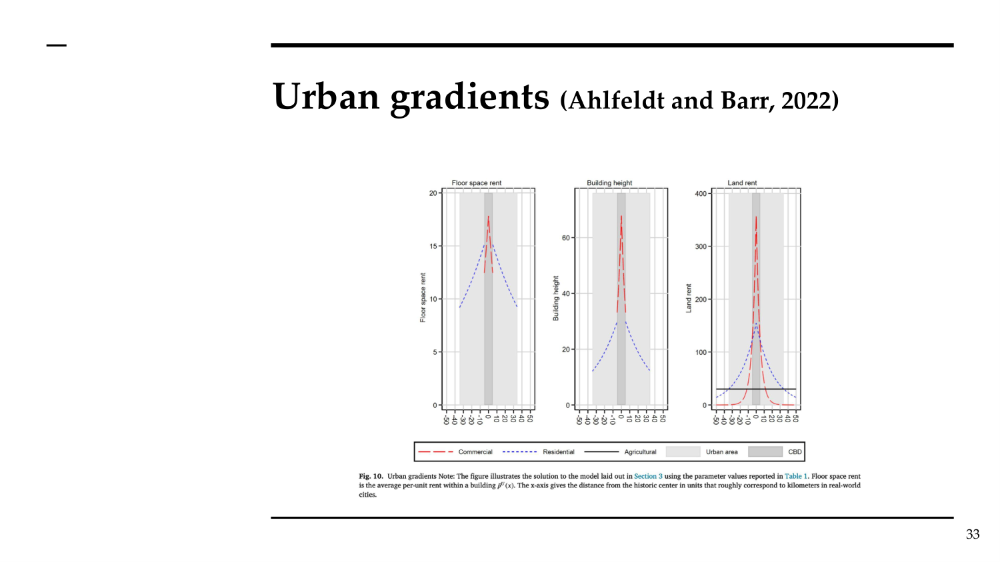

# AT Topic 7: The Vertical Dimension of Cities (Skyscrapers)
> 课件：AT_Topic7_Gentrification.pdf（实为Topic 7内容）| 讲师：Sara Bagagli

---

## 本讲框架

```
1. 摩天楼模型 — 垂直与水平成本收益，一般均衡
2. 建筑高度与租金 — 垂直租金梯度
3. 建筑成本 — 高度弹性
4. 均衡与反事实 — 城市化↔摩天楼化；高度限制
```

---

## 一、为什么要研究垂直维度？

城市不仅向外扩张（水平），也向上发展（垂直）。

**历史背景**：
- 伦敦圣保罗大教堂（111m）：1708-1963年间伦敦最高建筑
- 今天The Shard（310m）2012年成为新标志
- 过去50年高层建筑大幅增加

**研究意义**：
- 高层建筑影响土地价值、城市密度、福利
- 建筑高度限制（规划政策）的经济效应
- "摩天楼比赛"（height competition）——是理性还是非理性？

---

## 二、Ahlfeldt & Barr (2022) 模型框架

### 2.1 模型要素

```
居民（Workers）× 企业（Firms）× 开发商（Developers）→ 一般均衡
    ↓                 ↓              ↓
  选择位置x,楼层s   选择位置x,楼层s  选择建筑高度S
  最大化效用U      最大化利润π      最大化利润π_U
```

关键创新：同时考虑**水平**（距CBD距离x）和**垂直**（楼层s）两个维度

### 2.2 居民选择

效用函数：U(x,s) = A_R(x,s) · g^α · f_R(x,s)^(1-α)

- 居住便利设施A_R：随楼层↑而↑（视野、安静），随距离x↑而↓（通勤成本）
- f_R：居住建筑面积；g：其他商品消费
- 水平bid-rent随x增加而下降（同AMM模型）

### 2.3 企业选择

生产函数：g(x,s) = A_C(x,s) · L^β · f_C(x,s)^β

- 生产便利设施A_C：随楼层↑而↑（形象/可见性/溢出），随x↑而↓（集聚溢出衰减）
- 企业水平bid-rent也随x增加而下降

### 2.4 开发商选择最优建筑高度

开发商利润：π_U = p(x)·S(x) - c(S(x))·S(x) - r(x)

- p(.) = 建筑面积租金 = p_U · S^ω（ω = 租金对高度的弹性）
- c(.) = 建设成本 = c_U · S^θ（θ = 成本对高度的弹性）
- r(.) = 地价

**最优高度条件**：MR = MC（边际租金收入 = 边际建设成本）



**要点**：MR（每层边际租金收入）和 MC（每层边际建设成本）均向上倾斜，MC 更陡。在 S\* 处 MR=MC，利润最大化。竞争使利润全部资本化进地价（阴影区域）。

开发商之间完全竞争 → 零利润 → 利润全部资本化进**地价**

---

## 三、垂直租金梯度（实证）

### 3.1 商业建筑垂直租金梯度（Liu et al. 2018）

**研究设置**：分析楼层与租金关系，控制建筑固定效应

**关键数字**：

| 指标 | 估计值 | 含义 |
|------|--------|------|
| α（租金对楼层弹性） | **8.58%** | 每高一层，租金增加8.58% |
| 底层溢价 | **~13%**（= e^0.1156 - 1） | 商铺零售溢价 |
| ω（租金对建筑高度弹性） | **7.1%** | 跨建筑比较 |



特征：底层溢价（零售驱动）+ 越高越贵（办公室主导）——实际数据显示底层+高层均有溢价

### 3.2 住宅建筑垂直租金梯度

- 正梯度：更高楼层 → 更好视野、更少噪音 → 租金更高
- **但**：随时间下降（为什么？可能与密度增加、视野受阻、电梯技术改善有关）
- 住宅垂直梯度在电梯技术改善后减弱（底层曾有便利溢价）

---

## 四、高度建设成本（Construction Cost Elasticity）

### 4.1 Ahlfeldt & McMillen (2018)

**研究问题**：建设成本随楼层数增加的弹性有多大？

**回归方程**：ln(K/F) = α + θ·ln(Sᵢₜ) + εᵢₜ

- K = 总建设成本（不含土地）
- F = 总建筑面积
- S = 建筑高度（楼层数）

**关键发现**：

| 建筑类型 | 高度弹性θ | 含义 |
|----------|-----------|------|
| 商业 | 随高度增加 | 非线性！ |
| 住宅 | 高于商业 | 住宅建高楼成本更高 |
| 经验法则 | ~2%/层 | 对最高建筑约有效 |

**"2%法则"**（伦敦环境部1971）：每增加一层，单位面积建设成本增加约2%
- Ahlfeldt & McMillen验证：对最高建筑大致成立，但成本弹性随高度非线性增加



---

## 五、比较静态与政策含义

### 5.1 城市化→摩天楼化

问题：摩天楼是城市化的**原因**还是**结果**？

**模型实验**：改变集聚弹性β（β = 0.03基准，考虑±0.05变化）

| 集聚弹性β↑ | 效应 |
|-----------|------|
| 工资↑ | 城市更有吸引力 |
| 人口↑ | 外来人口涌入 |
| 城市面积↑ | 水平扩张 |
| 地价租金↑ | 需求拉动 |
| 建筑高度↑ | 垂直扩张 |

**结论：城市化导致摩天楼化（需求侧）**

### 5.2 摩天楼化→城市化

**模型实验**：改变高度成本弹性θ（降低 = 建高楼更便宜）

| 建设成本弹性θ↓ | 效应 |
|--------------|------|
| 建筑高度↑ | 供给增加 |
| 租金↓ | 单位面积更便宜 |
| 人口↑ | 城市吸引力↑ |
| 城市面积↑ | 水平和垂直均扩张 |
| 工资↑ | 集聚效应↑ |
| 地价租金↑↑ | 土地稀缺 |

**结论：摩天楼化也导致城市化（供给侧）**



### 5.3 高度限制的效应

**政策实验**：引入建筑高度上限 S̄

| 效应 | 方向 |
|------|------|
| 建筑高度 | ↓（显然） |
| 地价租金 | ↑（供给减少） |
| 人口 | ↓（城市吸引力降低）|
| 城市面积 | ↓ |
| 工资 | ↓ |
| 总体福利 | **↓**（土地所有者收入减少） |

**注意**：开放城市中，福利用**地价减少**来衡量（因为人口可以离开）

高度限制的权衡：规划者担忧负外部性（视线遮挡、拥挤、日照）vs 经济成本（租金↑、人口↓、工资↓、福利↓）

→ 开发商策略：雇用"Trophy architects"（明星建筑师）让规划者多批准14层，代价：建设成本增加~13%

---

## 六、城市结构均衡总结



商业：高θ（强CBD集聚）→ 高bid-rent、高建筑；住宅：中θ（通勤成本）→ 中bid-rent、中等建筑

---

## 七、考试要点

### 核心数字

| 数字 | 来源 | 含义 |
|------|------|------|
| **8.58%** | Liu et al. (2018) | 商业租金对楼层弹性 |
| **~13%** | Liu et al. (2018) | 底层商铺溢价 |
| **7.1%** | Liu et al. (2018) | 租金对建筑高度弹性（跨建筑） |
| **~2%/层** | Ahlfeldt & McMillen (2018) | 高度建设成本增加率（经验法则） |
| **14层** | 伦敦研究 | 明星建筑师让规划者额外批准的楼层 |
| **~13%** | 伦敦研究 | 明星建筑师增加的建设成本 |

### 核心结论

1. **城市化↔摩天楼化**：双向因果关系，正反馈循环
2. **垂直租金梯度**：底层零售溢价 + 高层办公溢价（非单调）
3. **高度限制**：租金↑但福利↓（在开放城市）
4. **建设成本**：非线性，约2%/层（对最高建筑），住宅比商业贵

### 可能考题

**Partitioned型**（更可能）：
- (a) 解释为什么建筑高度随距CBD距离增加而下降
- (b) 描述商业建筑内的垂直租金梯度（Liu et al. 2018）。什么驱动底层溢价？
- (c) 高度限制如何影响租金、人口和福利？（开放城市）

**与其他主题的联系**：
- 连接Muth-Mills（结构密度S = K/L）→ 垂直模型（S = 楼层数）
- 连接Rosen-Roback（生产和居住便利设施）→ 垂直模型中两种便利设施均与楼层相关
