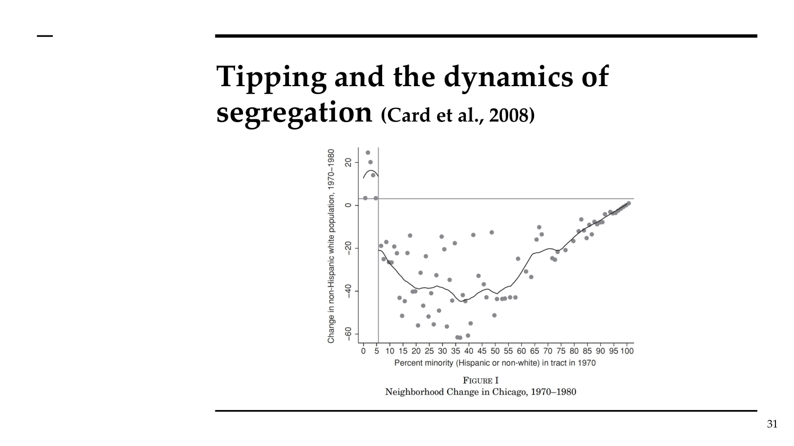

# AT Topic 8: Neighborhoods and Segregation
> 课件：AT_Topic8_House_Prices.pdf | 讲师：Sara Bagagli

---

## 本讲框架

```
1. 住房与邻里特征 — 特征价格模型（hedonic）；邻里影响
2. 住房歧视 — Redlining（红线政策）
3. 隔离理论 — 美国贫民区的兴衰
4. 白人大逃亡（White Flight） — Boustan (2010)
5. 种族倾覆点（Tipping Point） — Card et al. (2008)
6. 交通基础设施与隔离 — Bagagli (2025)
7. 隔离的后果 — 贫困、流动性；族裔聚居区
```

---

## 一、住房的特殊性

住房不同于普通商品：
- **高度耐久**：市场由存量（existing stock）主导，新建很少
- **不可移动**：选择房屋 = 选择居住地点（含邻居、学校质量、可及性、犯罪率）
- **邻里选择**：等同于选择一揽子地方公共品和融资税收

---

## 二、特征价格模型（Hedonic Model）

**核心思想**：房屋由多种特征组成，每种特征有隐含价格。市场价格 = 各特征价格之和。

**基本回归**：

ln(HouseValue) = a₀ + a₁·Size + a₂·Beds + a₃·Garden + a₄·Tube + ε

→ 系数aᵢ = 某特征的隐含价格

**文献中的邻里特征影响方向**：

| 特征 | 价格影响 |
|------|----------|
| 学校质量↑ | ↑ |
| 公园可及性 | ↑ |
| 步行至公共交通 | ↑ |
| 邻里收入水平↑ | ↑ |
| 历史价格涨幅↑ | ↑ |
| 分区或限制性条款 | ↑ |
| 犯罪率↑ | ↓ |
| 航班噪音↑ | ↓ |
| 工业噪音↑ | ↓ |
| 空气污染↑ | ↓ |
| 距就业中心远 | ↓ |
| 距高速公路近 | ↓（市中心）|
| 地处洪泛区 | ↓ |

---

## 三、住房歧视与红线政策（Redlining）

**背景**：美国住房自有率种族差距
- 2001年：白人74.3% vs 非裔美国人47.7% vs 拉丁裔47.3%

**HOLC地图（1930年代）**：
- 美国住房业主贷款公司绘制的"社区风险评级图"
- 评级：A（最佳）→ D（"危险"，红色标记）
- 评级标准包含种族/民族构成
- 结果：**红线区域**的抵押贷款申请被拒，即使借款人信用良好

**"Redlining"定义**：
> "向信用良好的申请人拒绝贷款，仅因申请房屋位于特定邻里"

**长期后果**（Aaronson et al. 2021）：D级邻里至今房价显著更低

---

## 四、隔离理论：美国贫民区的兴衰（Cutler et al. 1999）

### 4.1 历史分期

| 时期 | 特征 |
|------|------|
| 1890-1940 | 城市贫民区诞生 |
| 1940-1970 | 贫民区扩张 |
| 1970-1990 | 贫民区衰退 |

**关键数据**：1970年平均非裔美国人住在68%非裔邻里；1990年降至56%非裔

### 4.2 三种隔离理论及其对房价的预测

| 理论 | 机制 | 非裔住房成本 vs 白人 |
|------|------|----------------------|
| **入港理论** (Port of Entry) | 少数族裔偏好与同族人居住 | 非裔付**更多**（自愿集聚） |
| **集中/集体行动种族主义** | 白人用法律/暴力阻止非裔进入白人邻里 | 非裔付**更多**（被排除在外） |
| **分散种族主义** | 白人主动付更多以避免与非裔为邻（出逃） | 非裔付**更少**（白人离开→价格下跌）|

### 4.3 实证发现

**1950年代**：高度隔离源于白人的**集体行动**（限制性契约、暴力）
→ 更隔离的城市中，非裔家庭为住房支付**更多**

**1990年代**：隔离来自**分散种族主义**，白人付更多以住在白人邻里
→ 非裔支付的隔离溢价减少

---

## 五、白人大逃亡（Boustan 2010）

**研究问题**："战后郊区化是白人大逃亡吗？——来自黑人移民的证据"

**核心发现**：非裔人口迁入降低了对市中心居住的总需求，导致白人外迁和房价下跌。

**关键数字**：**每1个非裔人迁入，约2.7个白人迁出**

（但注意：无法区分种族偏见 vs 对新移民收入水平的排斥）

**Bid-rent解读**：
- 非裔迁入 → 白人愿付价格(bid-rent)下降 → 向郊区bid-rent曲线倾斜
- 市中心房价下跌，郊区房价上涨

---

## 六、隔离的倾覆点动态（Card et al. 2008）

### 6.1 Schelling (1971) 动态隔离模型

**机制**：个人有阈值偏好（要求X%的邻居与自己种族相同）
- 若低于阈值 → 搬走 → 引发连锁反应

**惊人结论**：即使个人对多元化**相对宽容**，也可能出现高度隔离
→ 人们可能自我隔离，即使他们偏好多元邻里

### 6.2 Card et al. (2008) 实证检验

**发现**：在许多美国邻里，存在**倾覆点**（少数族裔比例达10-20%）：
- 一旦超过倾覆点，白人居民以加速速度搬离
- 倾覆点前后少数族裔比例的微小差异导致邻里构成的巨大分化



**房地产含义**：接近倾覆点的邻里呈现强烈双峰分布（要么保持高白人比例，要么快速转变）

---

## 七、交通基础设施与隔离（Bagagli 2025）

**研究问题**：高速公路如何影响城市内的种族隔离？

**两大渠道**：

1. **负便利设施渠道（Disamenity Channel）**：
   - 高速公路制造污染、噪音等负效应
   - 近高速公路地区价值下降
   - 贫困非裔迁入，富裕白人迁出

2. **屏障效应渠道（Barrier Effect）**：
   - 高速公路成为城市内的物理屏障
   - 使人们能够在物理上与其他种族分隔

**关键发现**：
- 曝露于非裔每增加10个百分点 → 邻里非裔比例增加3个百分点（屏障效应）
- 反事实：若芝加哥高速公路埋入地下 → 隔离程度降低**17%**

**种族偏好的空间衰减**：
- 非裔：居住选择受10分钟内邻居种族影响
- 白人：受20分钟内邻居种族影响

---

## 八、隔离的后果

**负面影响**：
- 贫困率↑（Ananat, 2011）
- 向上流动性↓（Chyn et al.）
- 劳动力市场结果更差（Cutler & Glaeser, 1997）
- 更高犯罪率、死亡率、污染暴露

**族裔聚居区的作用（Edin et al. 2003）**：

**研究设计**：瑞典难民安置政策自然实验（随机分配城市）

**发现**：
- 短期：聚居区通过社会网络改善就业前景 ✓
- 长期：阻碍融入和经济进步 ✗

---

## 九、考试要点

### 核心数字

| 数字 | 来源 | 含义 |
|------|------|------|
| **74.3% vs 47.7%** | 2001年美国数据 | 白人 vs 非裔住房自有率 |
| **每1个非裔→2.7个白人外迁** | Boustan (2010) | 白人大逃亡规模 |
| **10-20%** | Card et al. (2008) | 种族倾覆点 |
| **17%** | Bagagli (2025) | 高速公路埋地后隔离下降 |
| **1970年68%非裔邻里** | Cutler et al. | 美国种族隔离峰值 |

### 三种隔离理论速记

```
入港理论: 少数族裔主动集聚 → 自付溢价
集中白人主义: 法律/暴力排斥 → 非裔付溢价（被迫）
分散白人主义: 白人主动逃离 → 非裔房价更低
                              （1990s美国现实）
```

### 可能考题

**Essay型**：
- "Discuss the economic theories and evidence on racial segregation in cities. What are the consequences for real estate markets?"
- 答题框架：三种理论 → Cutler et al.证据（1950s集中→1990s分散）→ Boustan白人大逃亡 → Schelling倾覆点 → 对房价的含义

**Partitioned型**：
- (a) 解释特征价格法（hedonic model）如何估计邻里特征对房价的影响
- (b) 区分三种隔离理论及其对非裔/白人住房成本差异的不同预测
- (c) Schelling (1971) 模型如何解释极端隔离来自相对温和的偏好？倾覆点的含义是什么？
