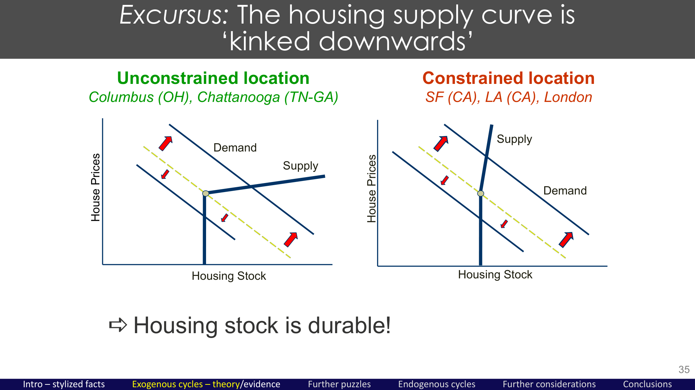

# WT Topic 4: Real Estate Cycles — Stylized Facts & Theory
> 讲师：Prof. Christian Hilber | 课件：WT_Topic4_Complete.pdf

---

## 本讲框架

```
1. 房地产周期的典型事实 — 历史证据
2. 周期的理论框架 — 为什么会有周期？
3. 供给约束与价格动态 — 弹性对周期的调节作用
4. 不对称供给曲线（Kinked Supply）
```

---

## 一、房地产周期的典型事实

### 1.1 历史证据

房地产价格的周期性特征有极长的历史记录：
- 荷兰阿姆斯特丹：17世纪以来的历史价格数据
- 挪威：19世纪到现在
- 美国：20世纪各波动

**主要特征**：
| 特征 | 描述 |
|------|------|
| **序列相关** | 价格高于趋势后，趋势继续延伸（动量） |
| **均值回归** | 长期内价格回归趋势 |
| **本地性** | 周期主要是本地现象（不同城市/地区高度不同步） |
| **持续时间** | 住宅周期约11-18年；商业周期更短 |
| **商业 vs 住宅** | 办公房价波动远大于住宅 |

### 1.2 跨城市对比：供给弹性的关键作用

**旧金山 vs 哥伦布（俄亥俄州）**：

```
旧金山（供给非弹性）：
  供给受限（地形+法规）→ 需求冲击→价格剧烈波动
  结果：极强的繁荣-萧条周期

哥伦布OH（供给弹性）：
  供给相对自由→ 需求冲击→数量调整，价格基本稳定
  结果：价格波动极小
```

---

## 二、理论框架：市场需求曲线和供给弹性

### 2.1 完全弹性需求的特殊情况

若有**完美替代品**（完全弹性需求）：
- 供给曲线斜率**不影响**价格资本化（始终100%资本化）
- 供给曲线只影响**数量**（不影响价格）

```
价格P
    |                    D（完全弹性）
    |————————————————————————————————
P*  |                   ●●●●●●●●●●●●
    |     S↑（供给增加）
    |_________________________________
             Q1  Q2              Q
```

### 2.2 现实：向下倾斜的市场需求（不完全替代品）

住房是有**位置差异**的，不是完全替代品：
- 伦敦的公寓 ≠ 伯明翰的公寓（完全不同的市场）
- → 需求曲线向下倾斜

此时：**供给弹性对价格响应至关重要**

```
价格P
    | S_非弹性（陡峭）   S_弹性（平缓）
    |     |              /
    |     |            /
    |     |          /
ΔP大|-----●         /   ← 非弹性：ΔP大，ΔQ小
    |    /●        /    ← 弹性：ΔP小，ΔQ大
ΔP小|---/  \      /
    |  /    \    /
    | /    D2\ D1（需求移动）
    |___________________________

需求从D1移到D2（右移）：
  非弹性供给 → 价格大幅上涨
  弹性供给   → 价格微幅上涨
```

---

## 三、不对称供给曲线（Kinked Supply Curve）

这是理解房地产周期的关键！

### 3.1 供给曲线为什么是弯折的（Kinked）？



**要点**：住房是耐久品 → 价格下跌不会触发拆除 → 供给向下无弹性（竖直）；价格上涨才触发新建 → 向上有弹性。

**原因**：住房是**耐久品**（durable good）
- 新建只在价格高于成本时发生（向上的供给弹性）
- 但已建成的住房不会因价格下跌而消失（向下价格→数量不减少）
- → 供给曲线在最低可行价格处弯折

### 3.2 弯折供给曲线的不对称含义

**对正向需求冲击（需求增加）**：
- 价格上涨 → 触发新建 → 供给响应（有弹性）
- 新建直到新均衡

**对负向需求冲击（需求减少）**：
- 价格下跌 → **不**触发拆除（住房存量不减少）
- 价格下跌 → 空置率↑（而非数量↓）
- 供给基本**无弹性**（向下价格没有去路）

```
不对称响应：
  需求↑：价格↑ → 新建↑ → 达到新均衡（有弹性）
  需求↓：价格↓ → 存量不变 → 空置↑ → 价格继续压低
         （无弹性，漫长调整过程）
```

### 3.3 空置率的作用

**空置率作为缓冲**：
- 需求↑时：先吸收已有空置，再触发新建
- 需求↓时：空置率累积，成为"价格下行压力的储水池"

---

## 四、周期的规律性

### 4.1 不同市场的价格波动

```
价格波动程度：
商业地产（办公/零售） > 住宅
弹性小城市（SF、伦敦） > 弹性大城市（休斯顿、凤凰城）
高端市场 > 低端市场
```

### 4.2 为什么商业地产比住宅更易波动？

| 因素 | 商业 | 住宅 |
|------|------|------|
| 规划/建设时滞 | 更长（复杂办公楼） | 相对较短 |
| 租约长度 | 长期（5-25年） | 短期（1年） |
| 需求波动 | 更大（随GDP波动） | 相对稳定 |
| 投资动机 | 主导 | 混合（消费+投资） |
| 期权价值 | 高（等待建设的期权） | 中等 |

---

## 五、考试要点

### 供给弹性与价格波动的关系总结

```
供给弹性↓ → 价格波动↑（需求冲击→更多价格响应）
弯折供给 → 不对称响应（上行更有弹性，下行更无弹性）
弹性供给市场（休斯顿）→ 建设繁荣但价格稳定
非弹性供给市场（SF）→ 价格剧烈波动
```

### 核心数字

| 数字 | 含义 |
|------|------|
| **11-18年** | 住宅周期的典型持续时间 |

### 可能考题

**Partitioned型**：
- (a) 什么是"弯折供给曲线"？它如何解释正向和负向需求冲击对房地产市场的不对称影响？
- (b) 为什么旧金山的房价比哥伦布（俄亥俄州）波动得多？供给弹性在其中扮演什么角色？
- (c) 为什么商业房地产周期比住宅周期更剧烈？

这个topic通常作为WT Topic 5的背景知识铺垫，考试更可能考Topic 5的具体文献和数字。
